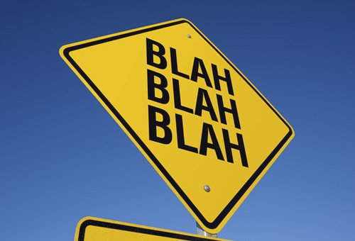
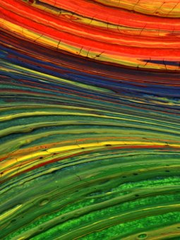

# bootstrap-foto-galeria

Es un plugin simple que que crear una galeria de fotos basada en Bootstrap. Soporta alturas variables para las imágenes y textos descriptivos.  También se incluye una caja modal con paginación "siguiente" y "anterior". El plugin requiere Bootstrap (3.3.5 o superior) y Jquery (1.10 o superior).


El plugin original es de Michael Soriano (http://michaelsoriano.com/) y las modificaciones mias son: 
 * un rótulo al pie de la imagen proviente del atributo "title" de la imagen
 * botones para los links "anterior" y "siguiente" y posicionado a izquierda y derecha (aparente 'bug' en el original)
 * dos variables para configurar el texto de los botones "previous" y "next"
 
###Modo de uso:

Asegurese de incluir los archivos requeridos antes del plugin.

Es necesario crear una lista sin orden de las imagenes.
```
 <ul class="first">
    <li>
        
    </li>
    <li>
        
    </li>
    <li>
        
    </li>
    ...
</ul>

```

Luego, se debe incializar el plugin y pasar las clases de Bootstrap para diferentes tamaños como un parámetro. El parámetro "hasModal" es true por defecto - pero puede ser apagado asignando "false".
Tambien existen ahora los parámetro "msgPrevious" y "msgNext" para colocar el texto de los botones en el idioma de preferencia.

```
$('ul.first').bsPhotoGallery({
    "classes" : "col-lg-2 col-md-4 col-sm-3 col-xs-4 col-xxs-12",
    "hasModal" : true,
    "msgPrevious" : "anterior",
    "msgNext" : "siguiente"
  });
```

Si usted necesita mostrar una imagen diferente en la caja modal, es necesario añadir el atributo extra para la imagen "data-bsp-large-src" con el valor de la ruta a la imagen.

